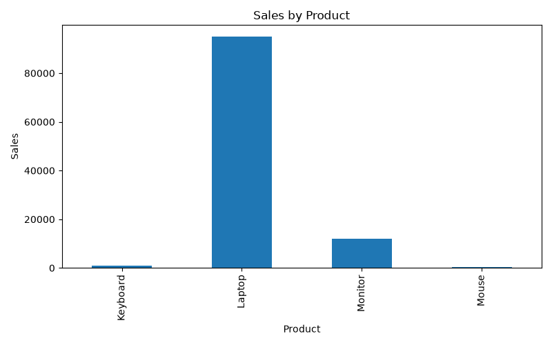
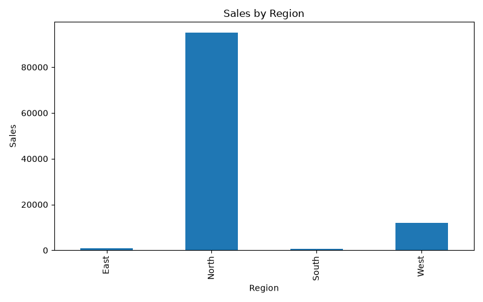
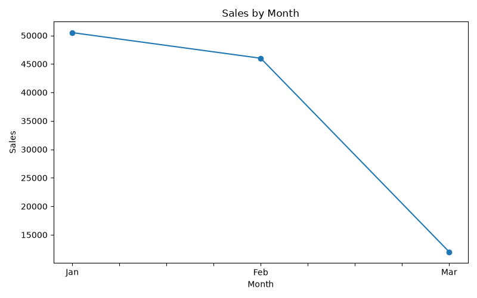

# 📊 Sales Data Analytics

A beginner-friendly data analytics project using Python, Pandas, and Matplotlib to analyze sales data and generate useful business insights.

## 🎯 Project Objective

The objective of this project is to analyze sales data and understand:

- Which product has the highest sales
- Which region generates the highest sales
- How sales change across different months
- Overall sales performance

## 🛠️ Technologies Used

- Python
- Pandas
- Matplotlib
- CSV Dataset
- GitHub

## 📁 Project Structure

```text
sales-data-analytics/
│
├── sales_data.csv
├── analysis.py
├── requirements.txt
├── README.md
│
└── charts/
    ├── sales_by_product.png
    ├── sales_by_region.png
    └── sales_by_month.png
```

## 🔍 Analysis Performed

### 1. Sales by Product

The project calculates total sales for each product and identifies the top-selling product.

### 2. Sales by Region

Sales are grouped by region to identify the region with the highest sales.

### 3. Sales by Month

Monthly sales are analyzed and visualized using a line chart.

## 📊 Visualizations

### Sales by Product


### Sales by Region


### Sales by Month


## 💡 Key Insights

- Laptop is the top-selling product.
- North is the highest-performing region.
- January has the highest monthly sales in the current dataset.

- ## 🚀 How to Run

1. Clone this repository.
2. Install the required Python libraries.
3. Run analysis.py.
4. View the generated visualizations in the charts folder.
